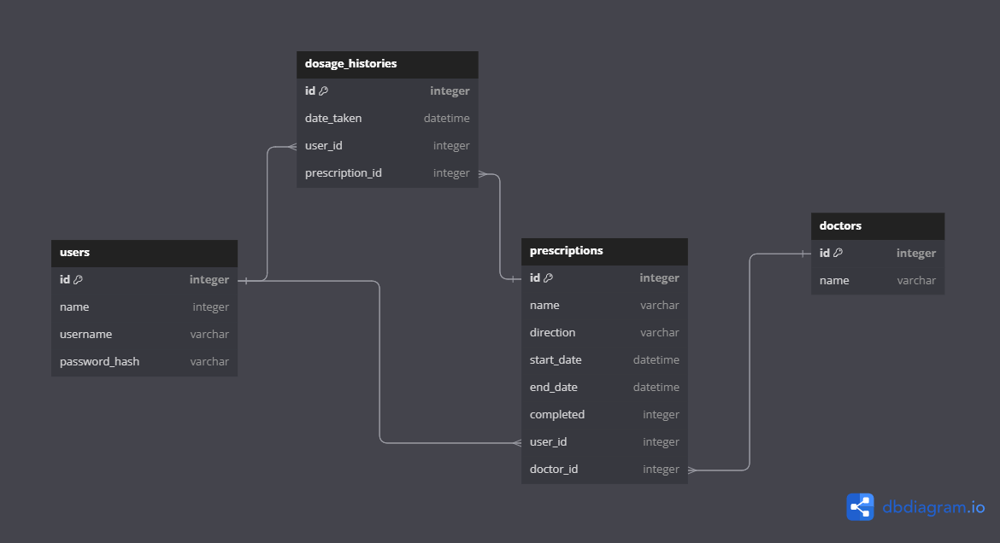

# Pill manager

### Owner: Tyler Kim

### Phase and Cohort:  Phase5 SE111323

## App Description:
Effortlessly take control of your prescriptions! With our user-friendly app, you can log in to efficiently manage your current prescriptions, track the history of medications, and easily mark doses as taken. Never forget or double up your doses!

## Domain ERD: 




## BACKEND (API)
### MODELS
* many-to-many relationship
* A `User` has many `Doctor`s through `Prescription`
* A `Doctor` has many `User`s through `Prescription`
* A `Prescription` belongs to a `User` and belongs to a `Doctor`
* A `Dosage history` belongs to a `User` and belongs to a `Prescription` 


## Deploy Application


Open two terminals side by side and in the first terminal run:
```
pipenv install 
pipenv shell
cd server
flask db upgrade head 
python seed.py 
python app.py
```
Then in the second terminal run:
```
cd client 
npm install 
npm start 

```

## MVP:
CRUD:

C. Add users, prescriptions, side effects, dosage history

R. View users, prescriptions, side effects, dosage history

U. Update users, prescriptions, side effects, dosage history

D. Delete users, prescriptions, side effects, dosage history

## CONTROLLERS
​​API routes 
RESTful conventions 

```
```
GET /users/
POST /users/
PATCH /users/<int:id>
DELETE /users/<int:id>
```
```
GET /prescriptions/
POST /prescriptions/
PATCH /classes/<int:id>

```
```
GET /doctors/
PATCH /doctors/<int:id>
POST /doctors/<int:id>
DELETE /doctors/<int:id>
```
```
GET /dosage_history/
POST /dosage_history/<int:id>


### validations 
* Add validations to the `user` model:
* - must have a `name`, `username`, and `password`
* Add validations to the `dosage history` model:
* - user and prescription `name`, `username`, and `password`


## FRONTEND (REACT)
- User, doctor, prescription, and dosage history components will fetch data from backend
- There are five different React Routes to manage organization in the app 


## EXTRA!
Stretch goals:
- Fetch drug information from public API to inform drug interactions


## Frontend Outline BOARD
https://excalidraw.com/#json=0UCaC7P4JPFx2KFazpqXg,V2Y9Ts7UCIi6i5U-zASfDw


